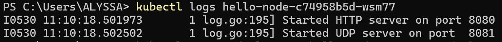
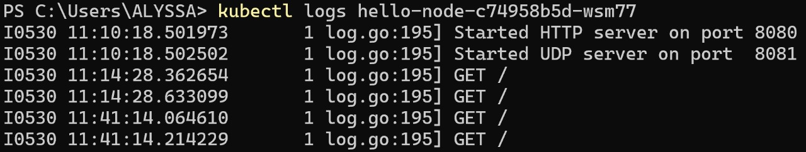
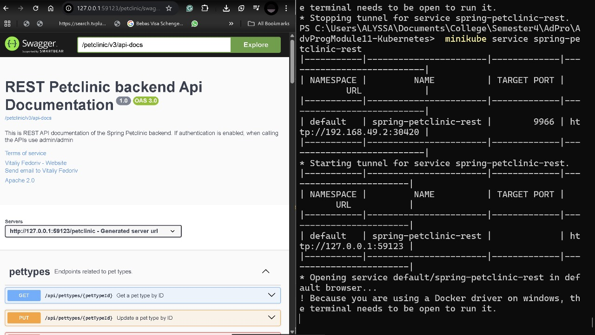
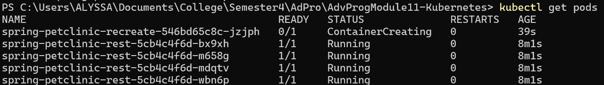
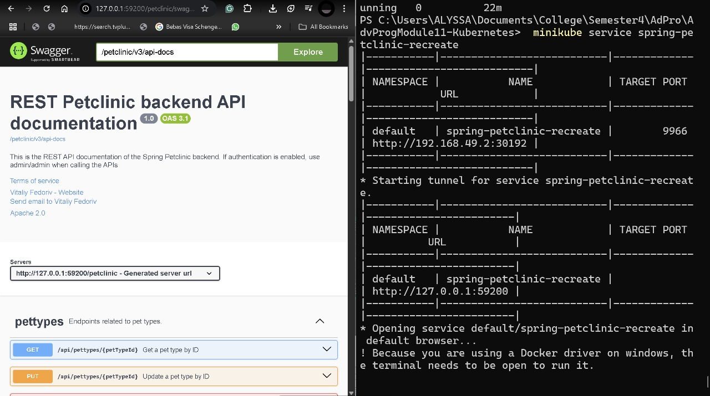

**Nama**: Alyssa Layla Sasti    
**Kelas**: AdPro B   
**NPM**: 2306152052  

# REFLECTION MODULE 11 KUBERNETES
## Reflection on Hello Minikube
- Sebelum Expose

- Setelah Expose

1. Compare the application logs before and after you exposed it as a Service. Try to open the app several times while the proxy into the Service is running. What do you see in the logs? Does the number of logs increase each time you open the app?
- Sebelum saya mengekspos aplikasi sebagai sebuah Service, log yang ditampilkan dari kubectl logs hanya menunjukkan bahwa server HTTP dan UDP berhasil dijalankan. Tidak ada aktivitas lain yang terlihat karena tidak ada request yang masuk ke dalam aplikasi. Namun, setelah saya mengekspos Deployment menggunakan kubectl expose dan menjalankan minikube service hello-node, saya bisa membuka aplikasi dari browser melalui alamat lokal yang disediakan (misalnya http://127.0.0.1:XXXX). Setiap kali saya membuka aplikasi tersebut di browser, saya melihat bahwa jumlah log di terminal bertambah. Log menunjukkan aktivitas permintaan HTTP yang masuk ke aplikasi. Ini membuktikan bahwa aplikasi memang menerima request dari luar setelah diekspos sebagai Service. Dengan kata lain, setiap interaksi saya dari browser menghasilkan tambahan entri di log aplikasi.

2. Notice that there are two versions of `kubectl get` invocation during this tutorial section. The first does not have any option, while the latter has `-n` option with value set to
`kube-system`. What is the purpose of the `-n` option and why did the output not list the pods/services that you explicitly created
- Dalam tutorial, saya menemukan bahwa ada dua bentuk perintah kubectl get yang digunakan: satu tanpa opsi tambahan, dan satu lagi dengan opsi -n kube-system. Opsi -n digunakan untuk menyaring namespace tertentu, dalam hal ini kube-system yang merupakan namespace khusus untuk komponen internal Kubernetes (seperti metrics-server, coredns, dan sebagainya).
- Resource seperti Deployment dan Service yang saya buat dengan kubectl create deployment dan kubectl expose secara default berada di namespace default, bukan kube-system. Oleh karena itu, ketika saya menjalankan kubectl get pods -n kube-system, tidak ada resource hello-node di situ. Hal ini menunjukkan pentingnya memahami namespace dalam Kubernetes agar bisa mengakses dan memonitor resource yang sesuai.

## Reflection on Rolling Update & Kubernetes Manifest File

1. What is the difference between Rolling Update and Recreate deployment strategy?  
Dari yang saya pelajari, perbedaan utama antara Rolling Update dan Recreate adalah pada cara mereka mengganti versi aplikasi yang sedang berjalan.
- Rolling Update mengganti Pod lama dengan Pod baru secara bertahap. Jadi, sebagian instance aplikasi tetap tersedia selama proses update berlangsung. Hal ini memungkinkan zero downtime, yang sangat penting untuk aplikasi yang harus selalu aktif.
- Recreate akan menghentikan semua Pod lama terlebih dahulu, lalu baru membuat Pod baru. Ini berarti aplikasi akan mengalami downtime untuk sementara waktu selama transisi versi berlangsung.
- Dalam praktiknya, Rolling Update cocok untuk aplikasi yang tidak boleh berhenti, sedangkan Recreate bisa digunakan jika data/state tidak perlu dipertahankan atau jika memang butuh “reset bersih”.

2. Try deploying the Spring Petclinic REST using Recreate deployment strategy and document your attempt.  
- Sebelum melakukan recreate, ini hasil deployed app saya

- Saya menjalankan command `kubectl create deployment spring-petclinic-recreate \ --image=springcommunity/spring-petclinic-rest \ --dry-run=client -o yaml > deployment-recreate.yaml`
- Kemudian saya menambahkan konfigurasi strategi Recreate
- Saya menjalankan command `kubectl expose deployment spring-petclinic-recreate --type=LoadBalancer --port=9966`
- Saya cek dengan `kubectl get pods`

- Saya menjalankan command `kubectl get services/spring-petclinic-recreate -o yaml > service-recreate.yaml`
- Saya cek deployed app nya `minikube service spring-petclinic-recreate`

3.  Prepare different manifest files for executing Recreate deployment strategy.  
Saya telah membuat file baru untuk deployment recreate seperti yang telah ada di file github ini

4. What do you think are the benefits of using Kubernetes manifest files? Recall your experience in deploying the app manually and compare it to your experience when deploying the same app by applying the manifest files (i.e., invoking `kubectl apply -f` command) to the cluster.  
Menurut saya, menggunakan Kubernetes manifest file memiliki banyak manfaat dibandingkan dengan perintah manual seperti kubectl create:
- Saya bisa mengatur semua konfigurasi secara eksplisit dalam satu file, termasuk strategi deployment, jumlah replica, label, dan port
- Saya tidak perlu mengingat atau mengetik ulang perintah panjang. Cukup kubectl apply -f untuk menjalankan atau memperbarui deployment.
- Manifest file ini bisa disimpan di repositori Git, sehingga bisa dilacak perubahannya dan bisa digunakan kembali dengan mudah.
- Lebih mudah untuk berkolaborasi dalam tim, karena konfigurasi disimpan sebagai file yang bisa di-review dan dimodifikasi bersama
- Saat saya membandingkan antara membuat deployment manual dan menggunakan manifest file, saya merasa manifest jauh lebih fleksibel, rapi, dan praktis, terutama jika ingin mengatur banyak aspek sekaligus atau melakukan deployment berulang.